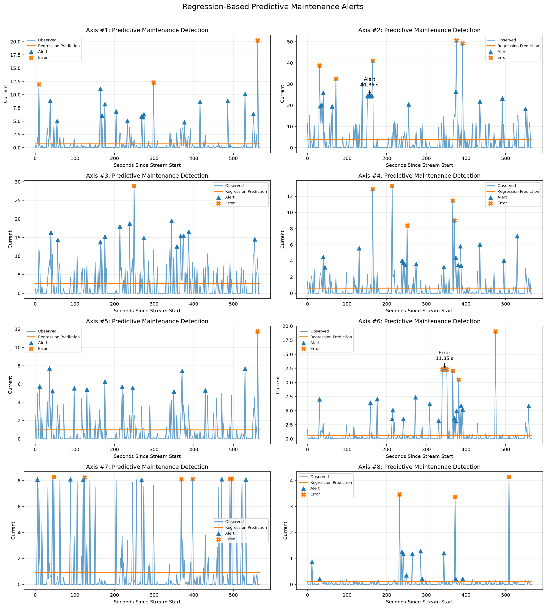

# Predictive Maintenance Alerts

## Project Overview

This project extends an industrial robot data-streaming pipeline with regression-based predictive maintenance detection.

Historical robot current data is uploaded to a Neon PostgreSQL database and retrieved from the database to train eight univariate Linear Regression models, one for each robot current axis. The models estimate expected current as a function of time.

Residuals between observed and predicted current are then analyzed to establish Alert and Error thresholds. Synthetic testing data is generated from the statistical characteristics of the training data, standardized and normalized using parameters learned from the training dataset, and passed through a simulated timestamp-ordered PostgreSQL streaming pipeline.

Sustained deviations from the regression baseline are classified as predictive maintenance Alerts or Errors and logged for later analysis.

## Project Structure

```text
PredictiveMaintenanceAlerts/
├── data/
│   ├── robot_data.csv
│   ├── synthetic_test_data.csv
│   └── alert_error_log.csv
├── figures/
│   └── predictive_maintenance_alerts.png
├── notebooks/
│   └── .gitkeep
├── prompts/
│   └── synthetic_data_prompt.md
├── src/
│   ├── database_manager.py
│   ├── regression_model.py
│   ├── data_generator.py
│   ├── anomaly_detector.py
│   ├── streaming_simulator.py
│   └── visualizer.py
├── PredictiveMaintenanceAlerts.ipynb
├── .gitignore
├── README.md
└── requirements.txt
```

## Technologies

The project was developed and tested with:

- Python 3.13.1
- pandas 3.0.6
- NumPy 2.5.3
- Matplotlib 3.11.2
- scikit-learn 1.9.1
- psycopg 3.3.6
- python-dotenv 1.2.4
- Jupyter 1.1.1
- ipykernel 7.4.0
- Neon PostgreSQL

## Database Pipeline

The project uses three PostgreSQL tables:

- `training_data` stores the historical robot dataset used for model training.
- `stream_data` stores timestamp-ordered synthetic testing observations.
- `anomaly_events` stores sustained Alert and Error events.

PostgreSQL `COPY` is used for efficient and reproducible transfer of the training and simulated streaming datasets.

The regression models are trained from data queried back from PostgreSQL rather than directly from the local training CSV.

## Regression Models

Eight independent univariate Linear Regression models are trained:

```text
Time → Axis #1
Time → Axis #2
Time → Axis #3
Time → Axis #4
Time → Axis #5
Time → Axis #6
Time → Axis #7
Time → Axis #8
```

Time is converted to elapsed seconds before model fitting.

The resulting R² values are close to zero for all eight axes. This indicates that elapsed time alone explains very little of the variation in robot current in this dataset.

This is an important result rather than an omitted model outcome: the assignment-required linear models provide a simple expected-current baseline, while residual analysis captures deviations around that baseline.

## Residual Analysis and Threshold Selection

For every observation:

```text
Residual = Observed Current - Predicted Current
```

Positive residuals represent current measurements above the regression baseline.

Thresholds are calculated separately for each axis because the eight current signals operate at substantially different scales.

- **MinC:** 95th percentile of the training residual distribution.
- **MaxC:** 99th percentile of the training residual distribution.
- **T:** 6 seconds.

The training data has a median sampling interval of approximately **1.891 seconds**. A duration threshold of 6 seconds therefore represents approximately three typical sampling intervals and prevents isolated threshold crossings from immediately becoming maintenance events.

### Discovered Thresholds

| Axis | MinC (95th percentile) | MaxC (99th percentile) |
|---|---:|---:|
| Axis #1 | 3.622423 | 10.637570 |
| Axis #2 | 13.548942 | 27.827261 |
| Axis #3 | 9.756149 | 22.004903 |
| Axis #4 | 2.506291 | 7.724843 |
| Axis #5 | 4.106583 | 8.931155 |
| Axis #6 | 2.498980 | 9.737241 |
| Axis #7 | 7.175265 | 7.227199 |
| Axis #8 | 0.096614 | 2.866628 |

## Alert and Error Rules

For each axis:

**Alert**

```text
Residual ≥ MinC continuously for at least T seconds
```

**Error**

```text
Residual ≥ MaxC continuously for at least T seconds
```

Error conditions take priority when a residual exceeds the Error threshold.

Individual threshold crossings are shown in the visualization, but only sustained conditions meeting the duration requirement are written to the final maintenance event log.

## Synthetic Testing Data

Synthetic testing data is generated separately from the training process.

The generator:

1. Uses training data retrieved from PostgreSQL.
2. Bootstraps complete training observations to preserve realistic relationships between the eight robot axes.
3. Adds small random variation to active current measurements.
4. Preserves non-negative current measurements.
5. Uses the median training sampling interval to construct synthetic timestamps.
6. Fits `StandardScaler` and `MinMaxScaler` using the training data only.
7. Applies those training-derived transformations to the synthetic testing observations.

The standardized and normalized values are retained in `data/synthetic_test_data.csv`, making the preprocessing procedure explicit and reproducible.

Controlled sustained deviations are introduced into the testing dataset so the Alert and Error pipeline can be validated.

## Streaming Simulation

The synthetic observations are sorted chronologically and transferred to the Neon PostgreSQL `stream_data` table.

The simulation uses accelerated playback: timestamps preserve the temporal sequence and sampling interval of the observations, while PostgreSQL `COPY` transfers them efficiently instead of deliberately waiting between every database insertion.

The detector operates on observations queried back from Neon, providing a complete database round-trip test:

```text
Training CSV
    ↓
Neon PostgreSQL
    ↓
Regression Training
    ↓
Residual Threshold Discovery

Synthetic Test Data
    ↓
Timestamp-Ordered Streaming Simulation
    ↓
Neon PostgreSQL
    ↓
Database Query
    ↓
Regression Predictions
    ↓
Residual Analysis
    ↓
Alert / Error Detection
    ↓
CSV + PostgreSQL Event Log
```

## Final Detection Results

After the synthetic test data was transferred to Neon and queried back from the database, the detector identified two sustained predictive-maintenance events:

| Axis | Event | Duration | Maximum Deviation |
|---|---|---:|---:|
| Axis #2 | Alert | 11.346 s | 20.688101 |
| Axis #6 | Error | 11.346 s | 11.684689 |

This database round-trip produced the same events as the pre-database synthetic test, confirming that the streaming/database stage preserved the observations required by the detection pipeline.

## Visualization

The final visualization overlays observed current, regression predictions, individual Alert/Error threshold crossings, and annotations for sustained maintenance events.



The visualization uses **seconds since the synthetic stream began** for readability. Regression calculations themselves continue to use elapsed time relative to the original training-data time origin.

## Setup and Reproduction

### 1. Clone the repository

```powershell
git clone https://github.com/JohnBuni/PredictiveMaintenanceAlerts.git
cd PredictiveMaintenanceAlerts
```

### 2. Create a virtual environment

```powershell
python -m venv .venv
```

Activate it in Windows PowerShell:

```powershell
.venv\Scripts\Activate.ps1
```

### 3. Install dependencies

```powershell
python -m pip install -r requirements.txt
```

The project was tested using **Python 3.13.1**.

### 4. Configure Neon PostgreSQL

This project requires access to the Neon PostgreSQL database through a `DATABASE_URL` environment variable.

For security, the `.env` file containing the database connection string is **not included in the GitHub repository** and is excluded through `.gitignore`.

The required `.env` file will be provided to the professor separately by email with the subject:

```text
9115726 - Predictive Maintenance Lab .env File
```

After downloading the `.env` file from the email, place it directly in the root of the cloned project:

```text
PredictiveMaintenanceAlerts/
├── .env
├── PredictiveMaintenanceAlerts.ipynb
├── README.md
├── requirements.txt
└── ...
```

The `.env` file contains the required database connection variable:

```text
DATABASE_URL=provided_postgresql_connection_string
```

No database tables need to be created manually. The notebook automatically creates the required `training_data`, `stream_data`, and `anomaly_events` tables when it runs.

**Do not commit or upload the `.env` file to GitHub.**

### 5. Register the Jupyter kernel

```powershell
python -m ipykernel install --user --name predictive-maintenance-alerts --display-name "Python (.venv - PredictiveMaintenanceAlerts)"
```

### 6. Open the project notebook

Open:

```text
PredictiveMaintenanceAlerts.ipynb
```

Select:

```text
Python (.venv - PredictiveMaintenanceAlerts)
```

as the notebook kernel.

### 7. Run the project

Restart the notebook kernel and select **Run All**.

The notebook will:

1. Verify the PostgreSQL connection.
2. Create the required database tables.
3. Load and preprocess the historical robot dataset.
4. Upload the training dataset to PostgreSQL.
5. Query the training dataset back from PostgreSQL.
6. Train all eight regression models.
7. Analyze residuals and calculate thresholds.
8. Generate, scale, and save synthetic testing data.
9. Introduce controlled predictive-maintenance conditions.
10. Simulate timestamp-ordered data transfer into PostgreSQL.
11. Query the simulated stream back from PostgreSQL.
12. Detect sustained Alert and Error conditions.
13. Save the final event log to PostgreSQL and CSV.
14. Generate and save the final predictive-maintenance visualization.

## Reproducibility

The notebook is designed to run from top to bottom from a fresh kernel.

Database tables used for training, streaming simulation, and event logging are cleared before their corresponding reproducible pipeline stages, preventing duplicate records when the notebook is rerun.

The `.env` file is intentionally excluded from Git because it contains the database connection string. A valid PostgreSQL `DATABASE_URL` must therefore be supplied before running the notebook.

## Key Findings

The eight time-based linear regression models produced very low R² values, demonstrating that elapsed time alone is not a strong predictor of the robot's current consumption.

Residual analysis nevertheless provides a measurable baseline for identifying unusually high current observations. Using axis-specific 95th- and 99th-percentile residual thresholds combined with a sustained-duration rule filters transient spikes from logged maintenance events.

The final database-backed test successfully detected the intentionally introduced Axis #2 Alert and Axis #6 Error while requiring both conditions to persist for at least the selected duration threshold.